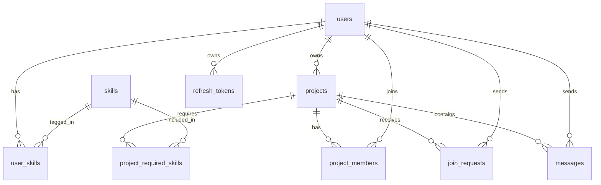

# DevLink ER Diagram

## Notes

- `projects` now carries `direction`, `team_size`, and `required_roles`.
- `join_requests` is separate from `project_members` so review states can be preserved.
- `messages` is already modeled for future realtime chat.
- `skills` is shared across both users and projects for consistent matching.
