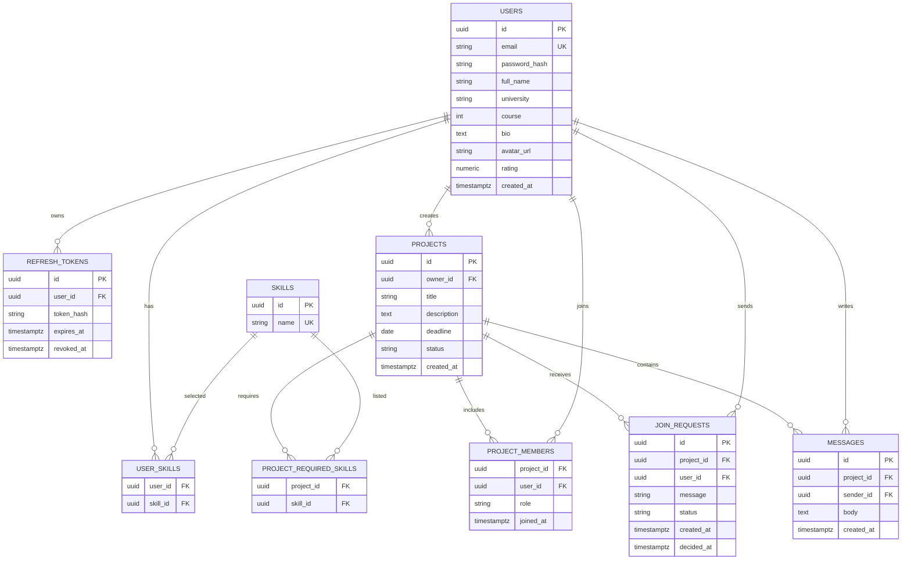

# ER-диаграмма EduMatch

## Mermaid ER

## Обоснование модели

- `users` хранит данные профиля и поля для поиска тиммейтов.
- `skills` вынесены в отдельную таблицу, чтобы фильтровать проекты и пользователей по единому справочнику.
- `join_requests` отделены от `project_members`, потому что заявка может быть отклонена или ожидать решения.
- `refresh_tokens` нужны для JWT + Refresh Token архитектуры.
- `messages` привязаны к проекту и отправителю, что подходит для WebSocket-чата внутри проекта.
