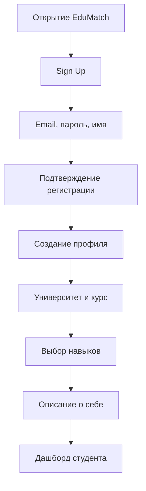
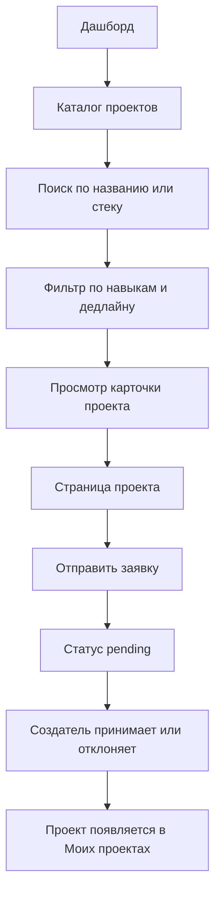
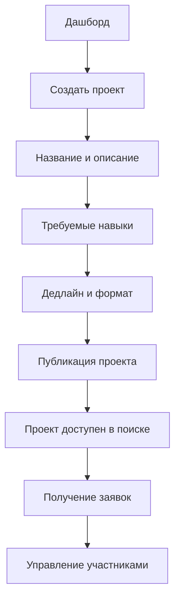
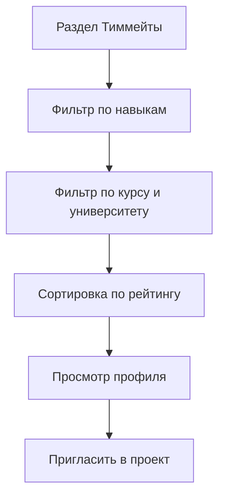
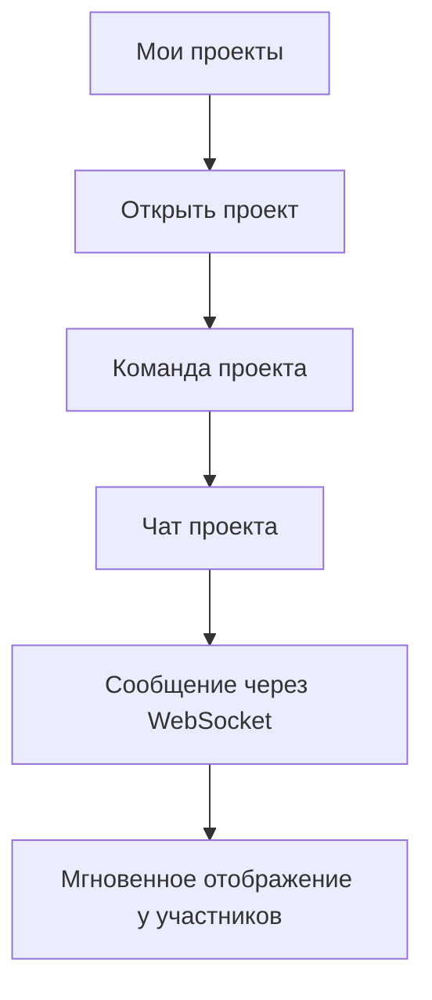

# User Flow EduMatch

## Основные роли

- Гость: может просматривать общую информацию, но не может подавать заявки.
- Студент: заполняет профиль, ищет проекты и тиммейтов, отправляет заявки.
- Создатель проекта: создает проект, управляет заявками, общается с командой.

## Flow 1: Регистрация и заполнение профиля

## Flow 2: Поиск проекта и подача заявки

## Flow 3: Создание проекта

## Flow 4: Поиск тиммейта

## Flow 5: Чат проекта

## Приоритет MVP

1. Регистрация, логин, refresh token, выход.
2. Профиль студента с навыками.
3. Создание и поиск проектов.
4. Заявки в проекты.
5. Дашборд с проектами и заявками.
6. WebSocket-чат внутри проекта.
